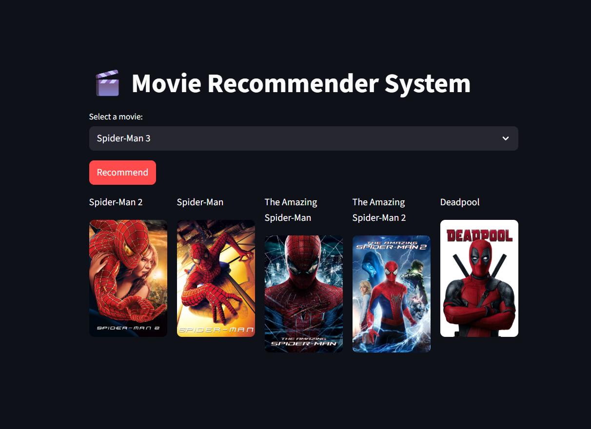

# Movie Recommender System 🎬🍿

## Project Overview

 - This is a Movie Recommender System built using Python, Streamlit, and machine learning techniques. The project is a result of self-study and hands-on learning in Data Science and Machine Learning. It allows users to select a movie and get 5 personalized movie recommendations with posters fetched from TMDB API.

- The app demonstrates the entire workflow from data preprocessing, feature extraction, similarity computation, to deployment, making it a full-stack Machine Learning project.



### Features

- Search and select a movie from a large dataset.
- Recommend 5 similar movies based on content similarity.
- Display movie posters alongside recommendations.
- Uses a similarity matrix for fast lookup.
- Handles large datasets using Google Drive integration for heavy .pkl files.
- Deployed live using Streamlit Community Cloud.

### Technologies & Packages Used

- Python – Core programming language
- Streamlit – Web app framework
- Pandas – Data manipulation
- Pickle – Save/load serialized Python objects
- Requests – API calls to TMDB for movie posters
- gdown – Download large files from Google Drive
- NumPy – Numerical computing
- scikit-learn – Machine learning & vectorization

### Data Preprocessing & Feature Engineering

- Data Collection: Combined two data sources into a single DataFrame.
- Data Cleaning: Removed duplicates, handled missing values, standardized formats.
- Feature Selection: Selected relevant columns for recommendations (title, genres, overview, cast, crew, keywords).
- Vectorization: Used CountVectorizer / TF-IDF to convert text features into numerical vectors.
- Similarity Computation: Calculated cosine similarity between movie vectors to find the closest matches.


### Deployment

- Platform: Streamlit Community Cloud (free)

### File Structure

```
Movie-Recommendation-App/
 ├── app.py                # Main Streamlit app
 ├── Assets/               # Local data files
 │    └── movies.pkl       # Movies dataset
 ├── .streamlit/
 │    └── secrets.toml     # API keys & file IDs (not pushed to GitHub)
 ├── requirements.txt      # Required Python packages
 └── README.md             # Project description
```

### How to Run Locally
Clone the repo:
```
git clone https://github.com/YourUsername/Movie-Recommendation-App.git
cd Movie-Recommendation-App
```

Install dependencies:
```
pip install -r requirements.txt

```
Add .streamlit/secrets.toml:
```
API_KEY = "your_tmdb_api_key_here"
FILE_ID = "your_google_drive_file_id_here"
```

Run the app:
```
streamlit run app.py
```
## Live Demo
[Click here to see the live app on Streamlit](https://movie-recommendation-app-74mux7mwl8vazsgfshaavp.streamlit.app/)

## GitHub Repository
[View the GitHub repo](https://github.com/DiilaNa/Movie-Recommendation-App.git)

## Author
- Dilan Liyanaarachchi

### YouTube Demo
[Watch the YouTube Demo](YOUTUBE_LINK)

